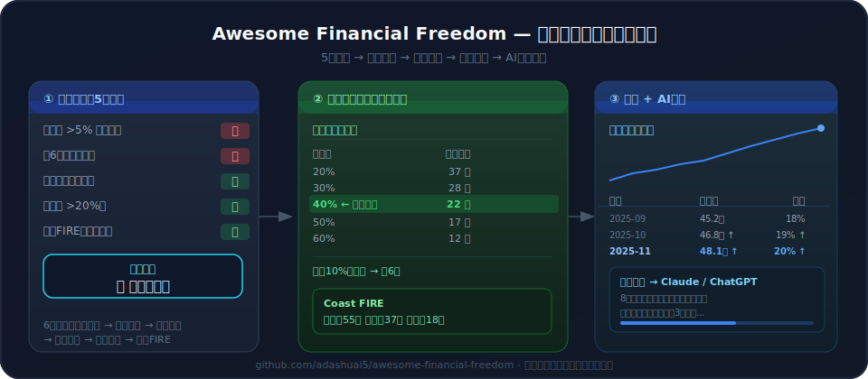

# Awesome Financial Freedom 🕊️

[English](./README.md) | [简体中文](./README.zh-CN.md)

> 一个 AI 原生的财务自由执行系统，不是收藏夹列表。
> 小白问 AI：我月薪 5000，存 1000，多久能退休？AI 直接给计划。

**Last updated: 2026-04-14**

## 🧭 项目导航

- **Playbooks**: [`playbooks/`](playbooks)
- **Workflows**: [`workflows/`](workflows)
- **Prompts**: [`prompts/`](prompts)
- **Agents**: [`agents/`](agents)
- **Data**: [`data/`](data)
- **Playbook 指南**: [`playbooks/guides/README.md`](playbooks/guides/README.md)
- **架构说明**: [`playbooks/guides/money-os-architecture.md`](playbooks/guides/money-os-architecture.md)
- **入门指南**: [`playbooks/tutorials/getting-started.md`](playbooks/tutorials/getting-started.md)
- **书籍摘要**: [`playbooks/book-summaries`](playbooks/book-summaries)
- **知识节点**: [`knowledge/nodes/`](knowledge/nodes)
- **Skills**: [`skills/`](skills)
- **Tools**: [`tools/`](tools)
- **贡献指南**: [`CONTRIBUTING.md`](CONTRIBUTING.md)

## 🤔 这是什么？

**Awesome Financial Freedom** 是一个开源、AI 原生的财务自由知识库。它将 awesome 列表的结构化策划与 AI Skill 对话能力结合，实现"零门槛"学习。

这个项目不只是静态链接列表，它提供：

- 📚 **结构化 JSON 知识节点**：覆盖心态、储蓄、投资和 FIRE 原则。
- 🤖 **开箱即用的 AI Skills**：兼容 Claude 和 ChatGPT，你可以问：
  - _"我月薪 5000，存 1000，多久能退休？"_
  - _"我的组合是 70% 标普 500、30% 债券，帮我看看。"_
  - _"什么是'双轮配置'方法？"_
- 🧮 **嵌入式计算器**：公式透明、步骤可验证。
- 📍 **学习路径指南**：分阶段推进、个性化目标设定。
- ✅ **可执行行动指南**：快速见效、风险意识的第一步，见 [`playbooks/guides/actionable-steps.md`](playbooks/guides/actionable-steps.md)。

**无需安装，直接在浏览器体验。**

输入你的当前存款、年支出、年储蓄和资产配置，系统返回：

- FIRE 目标金额
- 预计达成年限
- 关键行动建议
- 组合再平衡指导

## 🚀 直接体验

直接访问 GitHub Pages 演示：

- `https://adashuai5.github.io/awesome-financial-freedom/`

输入你的数字，即可看到 FIRE 目标、预计年限、行动建议和组合再平衡指导。

这是面向普通用户的浏览器体验版。

## 🎯 目标用户

- 想要一条直接通往财务自由的路径和可执行步骤的人
- 想存钱但不知道从哪开始年轻职场人
- 听说过 FIRE 但不知道怎么算的人
- 希望 AI 帮助规划财务的人
- 想把财务策略转化为可执行计划的人

## ✨ 为什么要做这个？

互联网上充斥着个人理财博客、付费课程和零散建议。但**没有一个开源、结构化、AI 就绪的财务自由执行系统**，专门帮助人们把计划变成行动。

这个项目填补了这个空白：提供一个**社区驱动、透明、可执行的 AI 规划系统**。核心创新在于将结构化工作流、Prompt 模板和计算器逻辑整合为一个可用的执行引擎。

## 📚 知识来源

精选洞察来自：

- 托尼·罗宾斯《钱：七步创造终身收入》（[Amazon](https://www.amazon.com/Money-Master-Game-7-Simple/dp/1476757801)）
- JL·柯林斯《简单到足以让孩子管钱》（[Amazon](https://www.amazon.com/Simple-Path-Wealth-financial-independence/dp/1533667926)）
- FIRE 数学（4% 法则、Trinity Study）（[Wikipedia](https://en.wikipedia.org/wiki/Trinity_study)）
- 邱岩《让钱去工作》（双轮配置）
- 更多见 `playbooks/book-summaries`

## 🔧 如何使用（最简单的办法）

### 0️⃣ 你会得到什么

这个项目给你一份真实的财务计划，不只是一份文档：

- FIRE 目标和预计财务独立年限
- 关于储蓄、投资和风险管理的精简行动方案
- 含买卖建议和风险说明的组合对齐指导

这些输出是项目的实际价值所在：一套结构化计划和清晰的的下一步。

### 1️⃣ 准备什么

你需要准备以下数字（填入演示页面）：

- 当前存款
- 年支出
- 年储蓄
- 预期回报率
- 安全提取率
- 资产配置（如 60% 股票、40% 债券）

### 2️⃣ 你会看到什么

系统会产生一份清晰可读的计划摘要：

- FIRE 目标
- 预计 FIRE 年限
- 关键行动建议
- 再平衡建议和风险说明

### 3️⃣ 直接体验

直接访问 GitHub Pages 演示：

- `https://adashuai5.github.io/awesome-financial-freedom/`

输入你的数字，看到 FIRE 目标、预计年限、行动建议和组合再平衡指导。

### 4️⃣ 何时深入探索

如果你想了解更多系统原理，可以探索：

- 规划逻辑
- AI Prompt 引导
- 计算器规则

建议在看到一次结果之后，再深入这些内容。

## 📖 知识结构

- 01-mindset/ — 心态与价值观
- 02-foundation/ — 核心财务健康
- 03-accumulation/ — 储蓄与收入增长
- 04-allocation/ — 资产配置与投资
- 05-automation/ — 自动储蓄与投资
- 06-freedom/ — FIRE 目标与提取策略
- 07-learning-path/ — 路径规划与分阶段行动指导

## 🤝 贡献

欢迎贡献！请参阅 [贡献指南](CONTRIBUTING.md) 了解更多。

## 📄 许可

- **知识内容**：采用知识共享署名-相同方式共享 4.0 国际协议（CC BY-SA 4.0）——详见 [LICENSE](LICENSE) 文件。
- **代码与工具**：采用 MIT 协议——详见 [LICENSE-CODE.md](LICENSE-CODE.md) 文件。