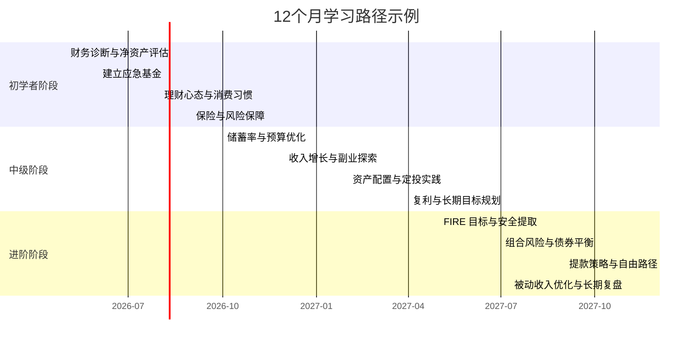

# 学习路径指南

本指南帮助你把财务自由学习拆成三个阶段，按照时间、目标和关键输出来安排你的进度。无论你是从零开始，还是已经有一定积累，都可以在这里找到阶段性路径和行动清单。

## 阶段概览

| 阶段   | 预计时长    | 核心目标                                                 | 关键输出                                               |
| ------ | ----------- | -------------------------------------------------------- | ------------------------------------------------------ |
| 初学者 | 0-6 个月    | 建立财务基础、现金安全、开启储蓄与投资习惯               | 完成应急基金、自测当前阶段、明晰收入与支出结构         |
| 中级   | 6-12 个月   | 制定目标、优化资产配置、开始自动化投资                   | 完成 FIRE 目标计算、建立定投计划、掌握资产配置原则     |
| 进阶   | 12 个月以上 | 强化被动收入来源、优化提款策略、实现财务自由或可持续退休 | 完成长期财务规划、构建多维资产组合、形成个人自由路线图 |

## 每个阶段的知识节点与行动清单

### 初学者阶段

- 需要掌握的知识节点：
  - `what-is-financial-freedom`
  - `money-as-tool`
  - `happiness-marginal-utility`
  - `net-worth-calculation`
  - `emergency-fund`
  - `insurance-basics`

- 行动清单：
  - [ ] 评估当前财务状况并计算净资产（1 个月）
  - [ ] 建立 3-6 个月生活费的应急基金（3 个月）
  - [ ] 理清收入、支出、债务和储蓄率（1 个月）
  - [ ] 学习“钱是工具”的心态与消费边际效用（1 个月）
  - [ ] 开始最低限度保障和基础保险配置（1 个月）

### 中级阶段

- 需要掌握的知识节点：
  - `savings-rate`
  - `income-growth-framework`
  - `side-hustle-starter`
  - `asset-allocation-basics`
  - `index-fund-why`
  - `dollar-cost-averaging`
  - `compound-interest`

- 行动清单：
  - [ ] 计算并提升你的目标储蓄率，找到可持续的储蓄习惯（2 个月）
  - [ ] 设计一个适合你的收入增长框架或副业计划（2 个月）
  - [ ] 学会自动化储蓄与定投，建立持续投资习惯（2 个月）
  - [ ] 了解资产配置基础和指数基金的优势（1 个月）
  - [ ] 用复利概念规划长期增长目标（1 个月）

### 进阶阶段

- 需要掌握的知识节点：
  - `fire-types`
  - `four-percent-rule`
  - `withdrawal-strategies`
  - `geo-arbitrage`
  - `dual-wheel-allocation`
  - `stock-bond-balance`

- 行动清单：
  - [ ] 计算你的 FIRE 目标本金并明确可接受的安全提取率（2 个月）
  - [ ] 评估并优化你的组合风险与股票债券平衡（2 个月）
  - [ ] 设计适合你的提款策略和现金流计划（2 个月）
  - [ ] 研究地理套利、生活成本下降和长期自由方案（2 个月）
  - [ ] 建立多元被动收入渠道，并定期复盘目标进度（2 个月）

## 不同目标的定制化建议

### 债务管理

- 如果你负债较多，先将重点放在“初学者阶段”且优先处理高息债务。
- 负债期间，可先建立 1 个月生活费的应急基金，避免还债过程中出现资金危机。
- 还清高息债务后，再补齐应急基金并进入资产配置与定投阶段。

### FIRE

- 目标是财务独立后选择提前退休或弹性退休。
- 在中级阶段重点计算 FIRE 目标本金，并搭配 4% 规则来估算安全提款金额。
- 进阶阶段需要关注提款策略、税务、地理套利与被动收入持续性。

### 创业者

- 创业者需要更高的收入增长能力和风险承受力。
- 初学者阶段应先保证现金安全，中级阶段可将一部分收入用于业务投入。
- 进阶阶段继续完善资产配置，避免创业风险与个人资产过度集中。

### 保守投资

- 更适合稳健型人群，侧重资产配置和防御性资产。
- 初学者阶段优先完成应急基金与保险配置，中级阶段建立稳健定投计划。
- 进阶阶段保持股票债券平衡，以更低波动实现长期财富增长。

## 12 个月示例时间线

## 你的行动计划

- [ ] 阅读本指南并确认你的当前阶段
- [ ] 在本文件中记录你的目标类型（如 FIRE、创业、稳健投资）
- [ ] 勾选你已经完成的学习节点和任务
- [ ] 每 1-2 个月回顾一次进展并调整路径
